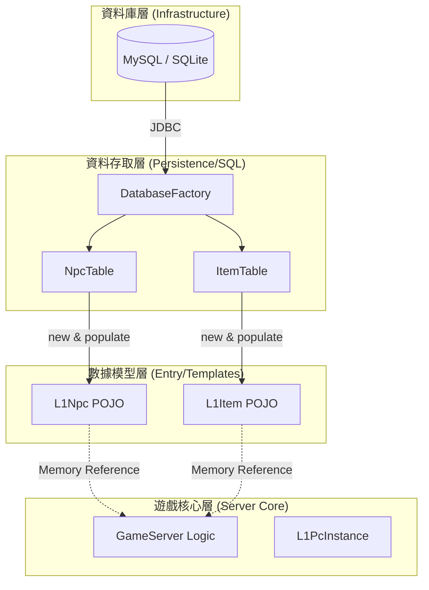
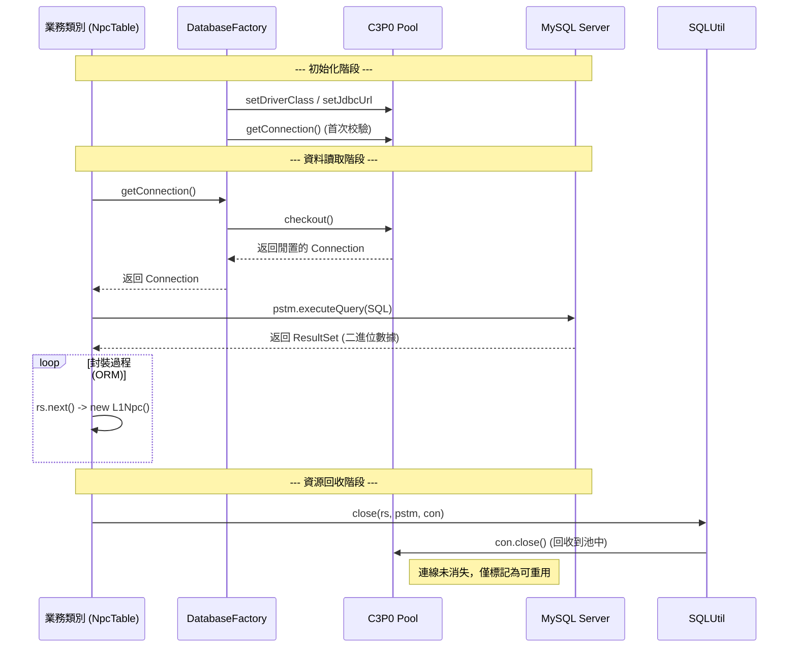
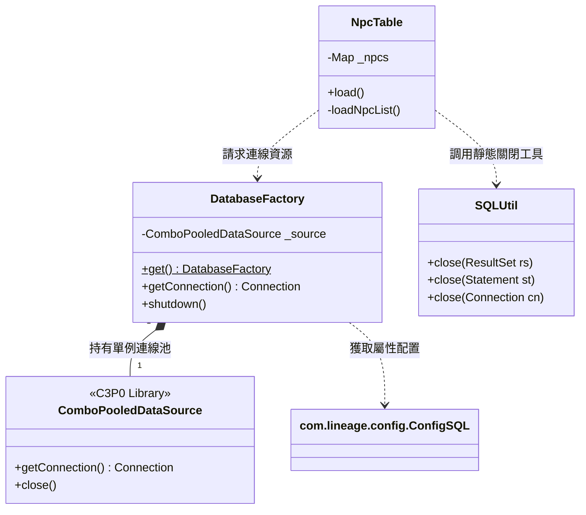

# Templates (POJO) 與 DataTable (DAO) 關係列表與遷移評估報告

本報告深入分析 `ThorLineageServer` 資料層的內部結構，詳細整理 POJO 模型與 DAO 實作的對應關係，並評估將「資料轉換邏輯」抽離的可行性。

## 1. 數據流轉與架構視覺化

為了更好地理解數據如何從資料庫流轉到記憶體模型，以下展示了核心架構與查詢流程。

### 1.1 數據流轉概覽 (Data Flow)
此圖展示了數據從底層資料庫經過 SQL 存取層，轉換為 Entry 模型，最後供應給遊戲核心層的過程。



### 1.2 資料查詢序列圖 (Query Sequence)
此圖詳細描述了業務類別透過 `DatabaseFactory` 向 C3P0 索取連線並執行 SQL 封裝的生命週期。



### 1.3 資料組件類別圖 (Class Diagram)
展示了連線管理、SQL 工具與業務資料表類別之間的靜態關係。



---

## 2. Templates (POJO) 與 DataTable (DAO) 完整映射分析

在 ThorLineageServer 中，並非每個 Table 都有對應的 Template，且有些 Template 會被多個 Table 共用。經過全專案掃描（包含 `com.lineage.server.datatables` 與 `com.lineage.server.datatables.sql`），整理出的對應關係如下：

| 業務模組 | 數據模型 (POJO / Templates) | 資料存取 (DAO / DataTable) | 主要資料庫表格 (SQL Tables) | 說明 |
| :--- | :--- | :--- | :--- | :--- |
| **核心 NPC** | `L1Npc` | `NpcTable`, `NpcSpawnTable`, `NpcChatTable`, `NpcScoreTable` | `npc_list`, `npc_monster` | L1Npc 是基礎，多個 Table 負責其產出與行為。 |
| **道具系統** | `L1Item`, `L1ItemsWeapon`, `L1ItemsArmor` | `ItemTable`, `ItemBoxTable`, `ItemUseTable`, `ItemTimeTable` | `etcitem`, `weapon`, `armor` | 包含武器、防具、藥水等的定義。 |
| **玩家帳號** | `L1Account` | `AccountTable` | `accounts` | 帳號基礎資料。 |
| **玩家角色** | `L1PcInstance` (及其基類) | `CharacterTable`, `CharObjidTable`, `CharOtherTable` | `characters` | 角色核心數據分佈於多個子表。 |
| **持有道具** | `L1ItemInstance` | `CharItemsTable`, `CharItemsTimeTable`, `CharItemsPowerTable` | `character_items` | 玩家身上道具的動態數據。 |
| **地圖數據** | `MapData` | `MapsTable`, `MapExpTable`, `MapLevelTable` | `mapids` | 地圖 ID 與其經驗加成、等級限制。 |
| **技能/魔法** | `L1Skills`, `L1SkillItem` | `SkillsTable`, `SkillsItemTable`, `MobSkillTable` | `skills` | 技能定義與其消耗道具、怪物技能。 |
| **刷怪系統** | `L1SpawnEx`, `L1SpawnTime` | `SpawnTable`, `SpawnTimeTable`, `SpawnBossTable` | `spawnlist` | 控制怪物在地圖上的重生。 |
| **任務系統** | `L1Quest`, `L1QuestUser` | `QuestTable`, `QuestMapTable`, `CharacterQuestTable` | `quest` | 任務定義與玩家完成進度。 |
| **傳送坐標** | `L1TeleportLoc` | `ItemTeleportTable`, `NPCTalkDataTable` | `etcitem_teleport` | 各種捲軸或 NPC 的傳送座標。 |
| **商店/交易** | `L1ShopS`, `L1ShopItem` | `ShopTable`, `ShopXTable`, `ShopCnTable`, `DwarfShopTable` | `shop` | NPC 商店與掛賣系統。 |
| **寵物系統** | `L1Pet`, `L1PetType` | `PetTable`, `PetTypeTable`, `PetItemTable` | `pets`, `pettypes` | 寵物屬性、種類與裝備。 |
| **社會系統** | `L1Clan`, `L1Mail`, `L1Board` | `ClanTable`, `MailTable`, `BoardTable` | `clan_data`, `mail`, `board` | 血盟、信件、公告欄。 |
| **拍賣行** | `L1AuctionBoardTmp` | `AuctionBoardTable` | `auction_board` | 拍賣行系統。 |
| **城堡/房屋** | `L1Castle`, `L1House` | `CastleTable`, `HouseTable` | `castle`, `house` | 城堡戰、房屋稅收與居住。 |
| **活動/競賽** | `L1Event`, `L1Gambling` | `EventTable`, `GamblingTable`, `UBTable` | `events`, `gambling` | 全服活動、賭博系統與無限大賽。 |
| **套裝效果** | `L1ArmorSets` | `ArmorSetTable` | `armor_set` | 套裝裝備屬性。 |
| **地圖元件** | `L1Trap`, `L1Furniture` | `TrapTable`, `TrapsSpawn`, `FurnitureSpawnTable` | `traps`, `furniture` | 陷阱、家具的佈置與觸發。 |
| **銀行系統** | `L1Bank` | `AccountBankTable` | `account_bank` | 玩家虛擬銀行。 |
| **魔法娃娃** | `L1Doll` | `DollPowerTable` | `doll_power` | 魔法娃娃能力。 |
| **經驗值表** | `L1Exp` | `ExpTable` | `experience` | 經驗值級距。 |

---

## 3. 文件數量差異分析 (71 Templates vs. 122 DAOs)

經讀取分析，導致 DAO 數量遠多於 POJO 的原因如下：

1.  **輔助性 Table (無對應 POJO)**：
    *   例如 `SqlError.java` (紀錄錯誤)、`BadIpDatabase.java` (黑名單)、`LogChatTable.java` (對話紀錄)。
    *   這些 Table 主要是執行 INSERT 或單純查詢，不需封裝為複雜物件。
2.  **多對一關係**：
    *   例如 `L1Item` 對應了 `etcitem`、`weapon`、`armor` 三張 SQL 表與多個 Table 類別。
3.  **功能型工廠 (Factories)**：
    *   例如 `FinalKillDropFactory.java` 被歸類在 datatables 下，但本質是邏輯處理器。

---

## 4. 轉換邏輯抽離評估

### 4.1 現狀分析 (Current Implementation)
目前將 **SQL 執行** 與 **結果集解析 (Result Set Parsing)** 全部耦合在 DAO 類別中。
```java
// 範例：耦合在 NpcTable.java 中
while (rs.next()) {
    L1Npc npc = new L1Npc();
    npc.set_npcId(rs.getInt("npcid"));
    // ... 手動賦值 ...
    _npcs.put(npc.get_npcId(), npc);
}
```

### 4.2 抽離方案：Mapper 模式的可行性
**結論：完全可行且強烈建議。**
透過將「從 `ResultSet` 到 `POJO`」的轉換邏輯抽離成獨立的 **Mapper 類別**，可以達成以下優勢：
1.  **複用性**：多個 Table 若讀取相同 POJO，可共用 Mapper。
2.  **單一職責**：DAO 負責 SQL，Mapper 負責物件轉換。
3.  **單元測試**：可模擬 `ResultSet` 測試 Mapper 邏輯。

---

## 5. 模組化拆分 (Server + Entry + SQL) 的具體價值

若將專案拆分為您構思的三個模組，開發流程將發生進化：

1.  **`thor-entry` (POJO 層)**：定義數據本體，**不依賴任何資料庫庫**。
2.  **`thor-sql` (實作層)**：實作 `RowMapper` 並執行 SQL。若要切換至 **SQLite**，只需提供新的 `thor-sql-sqlite` 並輸出相同的 POJO 即可。
3.  **`thor-server` (邏輯層)**：定義行為，僅操作 POJO 物件，完全不涉及 SQL。

### **結論：**
目前 `DataTable` 過於臃腫。第一步應將 `while(rs.next()){...}` 內部的封裝邏輯提取為獨立的 `mapRow` 方法，為後續一鍵切換資料庫提供最穩健的基礎。

---
*最後修正日期：2026/08/02*
