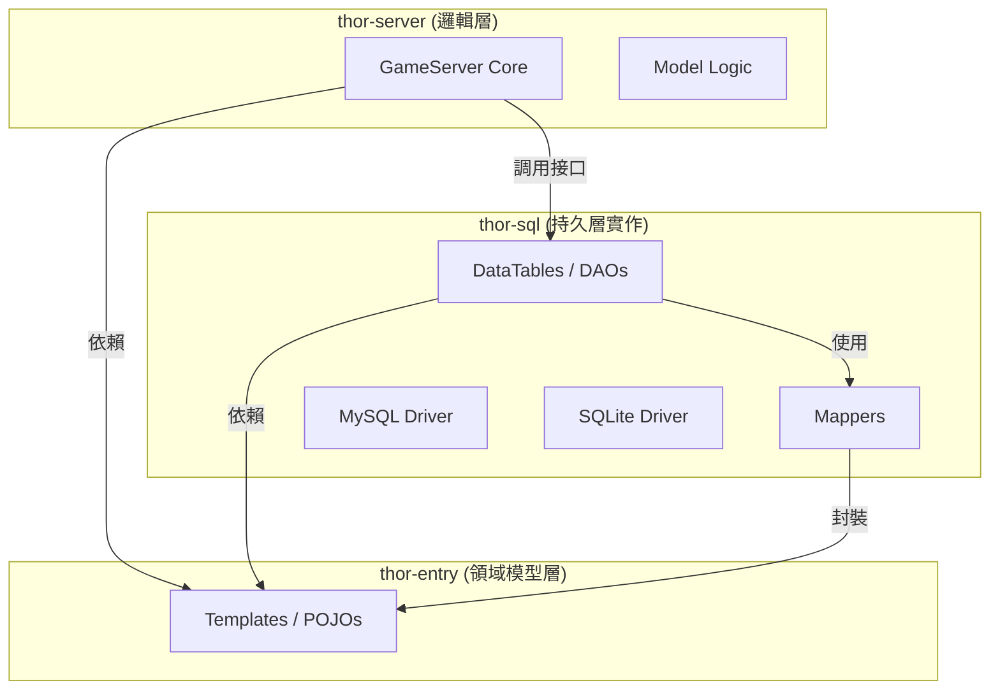

# DataTable 精簡化與專案物理模組化：深層重構策略報告

本報告針對 `ThorLineageServer` 的現代化演進路徑，詳細分析「DataTable 代碼精簡」與「物理模組拆分」兩大重構階段。這不僅是代碼品質的提升，更是為了實現「一鍵切換資料庫（MySQL/SQLite）」與「職責分離」的核心架構目標。

---

## 1. 核心定義與差異對照

重構過程分為兩個維度：**邏輯層面（內部精簡）**與**物理層面（外部拆分）**。

| 比較項目 | 階段一：DataTable 代碼精簡 (Logical) | 階段二：物理模組拆分 (Structural) |
| :--- | :--- | :--- |
| **定義** | 類別內部的 Java 代碼重構，將轉換邏輯抽離。 | 專案目錄結構與 Gradle 配置的重新定義。 |
| **處理對象** | `NpcTable`, `ItemTable`, `SkillsTable` 等類別內部。 | `Templates` 包、`DataTables` 包、`model` 包的物理位置。 |
| **核心動作** | 刪除數百行 `rs.get` 賦值代碼，改用 `Mapper.mapRow(rs)`。 | 建立 `thor-entry`, `thor-sql`, `thor-server` 等子模組。 |
| **主要目標** | 消除冗餘代碼，讓 DAO 只負責 SQL 執行。 | 實現物理隔離，解決依賴循環，支持多資料庫實作。 |
| **技術難點** | 確保映射字段的順序與 SQL Schema 100% 兼容。 | 處理模組間的 Import 重新導向與依賴配置。 |
| **切換資料庫的貢獻** | 準備好通用的「數據封裝工具（Mappers）」。 | 提供「插拔式（Plug-and-play）」的物理架構。 |

---

## 2. 階段一：DataTable 代碼精簡 (深層解析)

### 2.1 現狀：臃腫的 DAO (Fat DAO)
目前的 `DataTable` 實作違反了單一職責原則。一個類別同時負責：
1.  **SQL 指令維護** (SELECT/UPDATE/DELETE)。
2.  **JDBC 連線管理** (getConnection/close)。
3.  **ORM 轉換邏輯** (ResultSet -> POJO 的逐欄位賦值)。

### 2.2 重構後的形態
透過引入我們已建立的 20 個 Mapper，代碼將發生以下轉變：

**[重構前] 典型的 NpcTable 加載片段 (約 60 行)：**
```java
while (rs.next()) {
    L1Npc npc = new L1Npc();
    npc.set_npcId(rs.getInt("npcid"));
    npc.set_name(rs.getString("name"));
    npc.set_hp(rs.getInt("hp"));
    // ... 此處省略 50 行 rs.get 賦值 ...
    _npcs.put(npc.get_npcId(), npc);
}
```

**[重構後] 精簡後的 NpcTable 加載片段 (只需 2 行)：**
```java
while (rs.next()) {
    L1Npc npc = NpcMapper.get().mapRow(rs); // 核心轉換邏輯已移至 Mapper
    _npcs.put(npc.get_npcId(), npc);
}
```

### 2.3 精簡化的價值
*   **高可讀性**：開發者能一眼看出 SQL 查詢了什麼，而非淹沒在 setter 呼叫中。
*   **低維護成本**：如果資料庫欄位變動，只需修改一個 `NpcMapper`，所有涉及該 POJO 的 Table 都會同步生效。
*   **測試便利**：Mapper 可以獨立於資料庫連線池進行 Mock 測試。

---

## 3. 階段二：物理模組拆分 (結構藍圖)

在代碼精簡完成後，專案具備了物理拆分的條件。這將使 `ThorLineageServer` 從一個單體專案進化為**三層分層專案**。

### 3.1 依賴架構圖 (Dependency Graph)



### 3.2 各模組處理內容

#### **Module A: `thor-entry` (基礎數據模組)**
*   **內容**：原 `com.lineage.server.templates` 下的所有 Java 類別。
*   **特性**：**零依賴**。不依賴 MySQL, C3P0 甚至任何網路庫。
*   **目的**：定義「遊戲世界的語義」，如怪物的血量、道具的重量。這是最穩定的模組。

#### **Module B: `thor-sql` (數據實作模組)**
*   **內容**：原 `com.lineage.server.datatables`、`mappers` 以及 `DatabaseFactory`。
*   **特性**：依賴 `thor-entry`。
*   **目的**：專注於「如何與磁碟溝通」。這層模組可以有多個實作版本：
    *   `thor-sql-mysql`：生產環境使用，依賴 MySQL Connector。
    *   `thor-sql-sqlite`：開發/單機調試環境使用，依賴 SQLite JDBC。

#### **Module C: `thor-server` (核心邏輯模組)**
*   **內容**：Netty 通訊、AI 運算、`com.lineage.server.model`。
*   **特性**：依賴 `thor-entry` 獲取數據定義，依賴 `thor-sql` 的 API 觸發數據載入。
*   **目的**：專注於「遊戲邏輯」，與資料庫技術完全解耦。

---

## 4. 實作路徑圖 (Step-by-Step Road Map)

### **第一步：代碼精簡 (現在執行)**
1.  **逐一處理**：從 `NpcTable` 開始，將封裝邏輯委託給 `NpcMapper`。
2.  **編譯驗證**：確保 Table 類別雖然代碼變少了，但功能完全不變。
3.  **全面覆蓋**：完成所有 20 個 Mapper 的套用。

### **第二步：結構拆分 (後續執行)**
1.  **Gradle 初始化**：在專案根目錄建立子模組資料夾與 `build.gradle`。
2.  **物理移動**：將檔案從 `GameServer` 搬移至對應子模組。
3.  **解決編譯報錯**：修正因路徑更動導致的 `import` 語句錯誤。
4.  **連線工廠抽象化**：將 `DatabaseFactory` 設為介面，根據配置檔決定實例化 MySQL 版或 SQLite 版。

---

## 5. 總結

**「代碼精簡」是「物理拆分」的基礎。**
沒有精簡過的代碼，物理拆分會因為複雜的內部依賴而導致重構地獄。透過先將轉換邏輯 Mapper 化，我們讓數據傳輸變得「格式化」，這使得後續將 POJO 獨立成 `thor-entry` 模組時，不會帶出任何不必要的資料庫依賴。

這份策略將使 `ThorLineageServer` 具備極強的擴展性，無論未來是要開發新的數據驅動功能，還是要全面遷移至 SQLite，都能在不影響核心邏輯的前提下迅速達成。

---
*文件編撰日期：2026/08/02*
