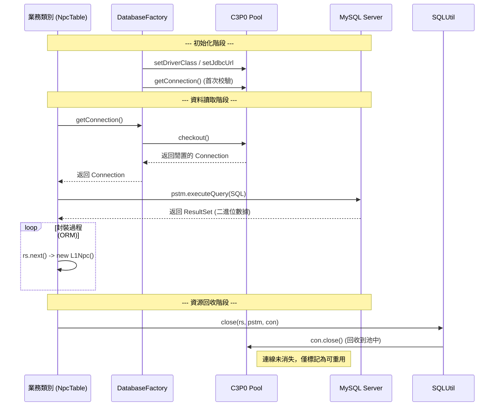
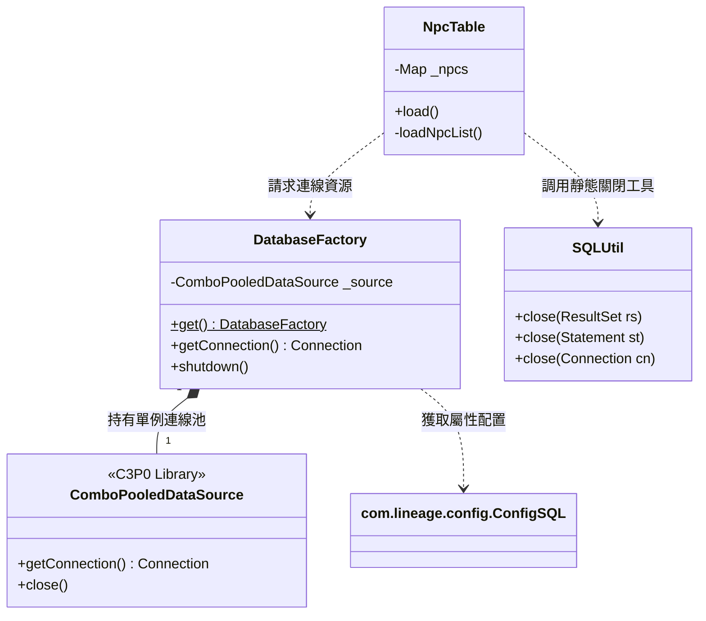

# 資料庫存取架構與 C3P0 連線池深度分析報告

本報告詳述 `ThorLineageServer` 如何透過 JDBC 與 C3P0 進行高效能的資料存取，包含組件角色、查詢流程、類別圖及未來優化方向。

## 1. 核心組件與職責分配

專案採用了分層式架構來處理資料庫互動，確保資料連線與業務邏輯解耦。

| 組件名稱 | 核心類別 | 職責說明 |
| :--- | :--- | :--- |
| **配置層** | `com.lineage.config.ConfigSQL` | 負責解析實體設定檔（如 `sql.properties`），將連線資訊轉為 Java 靜態變數。 |
| **連線管理層** | `com.lineage.DatabaseFactory` | **核心大腦**。內部封裝了 C3P0 的連線池實例，負責生命週期管理與 Connection 發放。 |
| **連線池實作** | `ComboPooledDataSource` | 來自 **C3P0** 庫。負責底層 TCP 連線的維持、重用與超時檢查。 |
| **資料表邏輯層** | `com.lineage.server.datatables.*` | 如 `NpcTable`, `ItemTable`。負責撰寫業務相關的 SQL 並執行結果集 (ORM) 轉換。 |
| **清理工具層** | `com.lineage.server.utils.SQLUtil` | 統一封裝了 SQL 資源的關閉邏輯，防止資源洩漏。 |

---

## 2. 資料查詢生命週期流程 (Sequence Diagram)

以下展示了一個典型的資料讀取請求（例如 `NpcTable` 載入 NPC 清單）的完整路徑：



---

## 3. C3P0 在其中的關鍵技術角色

C3P0 (ComboPooledDataSource) 不僅是一個工具，它是伺服器穩定性的守門員。

### 3.1 為什麼需要連線池？
*   **性能提升**：建立資料庫連線是一個耗時的操作（包含 TCP 三向交握、TLS 加密等）。C3P0 會預先在後台建立一定數量的連線，當伺服器需要讀取 NPC 或 玩家存檔時，可以實現 **"微秒級"** 的響應速度。
*   **斷線自動恢復 (Auto-Reconnect)**：
    *   C3P0 具有 `testConnectionOnCheckout` 機制。
    *   若 MySQL 伺服器短暫重啟，C3P0 會自動偵測到失效的連線並重新補齊，程式碼端完全不需要寫重連邏輯。
*   **高併發緩衝**：
    *   當數百名玩家同時存檔時，C3P0 會限制同時連向資料庫的總數，防止 MySQL 因連線數爆滿而崩潰。

### 3.2 專案中的初始化實作
```java
// 摘自 com.lineage.DatabaseFactory.java
private DatabaseFactory() {
    try {
        this._source = new ComboPooledDataSource();
        this._source.setDriverClass(_driver);
        this._source.setJdbcUrl(_url);
        this._source.setUser(_user);
        this._source.setPassword(_password);
        // 透過獲取再立即關閉來完成初始化校驗
        this._source.getConnection().close();
    } catch (final SQLException e) {
        _log.fatal("資料庫讀取錯誤!", e);
    }
}
```

---

## 4. 類別關係架構圖 (Class Diagram)



---

## 5. 實際代碼模式舉例 (NpcTable.java)

這是專案中最標準的資料讀取範本，遵循了 **"獲取 -> 使用 -> 歸還"** 的三部曲。

```java
private void loadNpcList() {
    Connection con = null;
    PreparedStatement pstm = null;
    ResultSet rs = null;
    try {
        // [1] 向 C3P0 請求連線
        con = DatabaseFactory.get().getConnection();
        
        // [2] 建立預編譯語句，防止 SQL 注入
        pstm = con.prepareStatement("SELECT * FROM `npc_list`");
        
        // [3] 執行查詢
        rs = pstm.executeQuery();
        
        // [4] ORC 封裝 (將關聯式數據轉為 Java 對象)
        while (rs.next()) {
            final L1Npc npc = new L1Npc();
            npc.set_npcId(rs.getInt("npcid"));
            npc.set_name(rs.getString("name"));
            // ... (更多屬性)
            _npcs.put(npc.get_npcId(), npc);
        }
    } catch (final SQLException e) {
        _log.error("載入 NPC 列表失敗", e);
    } finally {
        // [5] 透過 SQLUtil 安全釋放資源
        // 此處的 con.close() 是將連線交還給 C3P0，而非斷開資料庫
        SQLUtil.close(rs);
        SQLUtil.close(pstm);
        SQLUtil.close(con);
    }
}
```

---

## 6. 面向未來的現代化優化建議 (2026+)

1.  **更換連線池為 HikariCP**：
    *   **原因**：C3P0 歷史悠久但效能已略遜於現代工具。
    *   **優勢**：HikariCP 被稱為「目前最快的連線池」，且與 Java 11/17/22 整合度更高。
2.  **採用 Try-with-resources (Java 7+)**：
    *   **改進**：將 `finally` 中的 `SQLUtil.close` 替換為 `try (Connection con = ...) { ... }`。
    *   **優勢**：減少樣板代碼（Boilerplate Code），並自動處理所有資源的關閉。
3.  **ORM 框架遷移 (MyBatis / Hibernate)**：
    *   **原因**：目前的 `rs.getXXX()` 手動封裝方式在欄位多時極易出錯且難以維護。
    *   **優勢**：引入 MyBatis 可讓 SQL 邏輯獨立於 Java 代碼之外，提升可讀性。

---
*文件編撰日期：2026/08/02*
