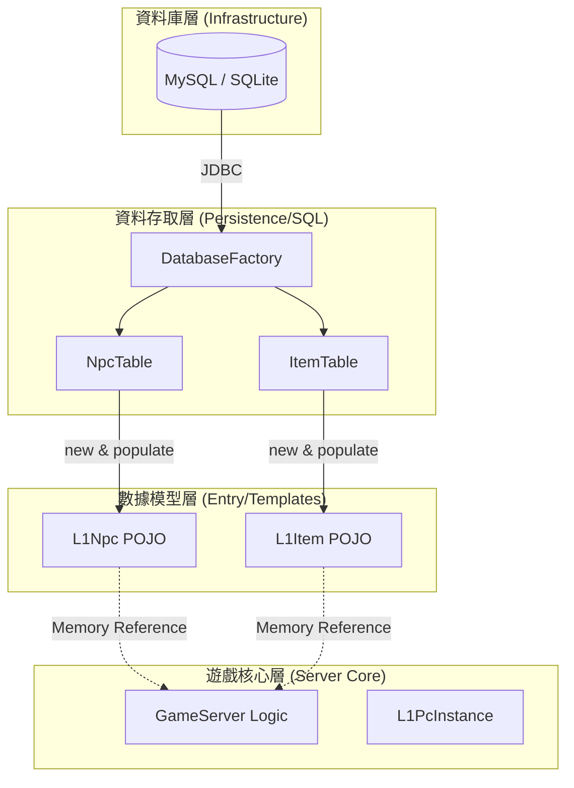

# 專案模組化拆分與數據流轉深度分析報告

本報告針對 `ThorLineageServer` 目前的數據處理架構進行深入剖析，釐清 `DataTable` (DAO) 與 `Templates` (POJO) 之間的核心關係，並提出將專案拆分為 `Server`、`Entry`、`SQL` 三個子專案的現代化重構方案。

---

## 1. 核心概念釐清：數據從 SQL 到記憶體的演進

針對資料庫層級與記憶體中數據關係的常見疑問，以下為深度解析：

### Q1: `XXXTable` (如 `NpcTable`) 是 SQL Schema 嗎？
**答案：不是。它是 DAO (Data Access Object) 或稱 Repository。**
*   **角色**：它扮演著資料庫與 Java 程式碼之間的「翻譯官」。
*   **職責**：包含具體的 SQL 語句（如 `SELECT * FROM npc_list`），並負責執行查詢。
*   **關鍵動作**：它將從 SQL 查到的「表格欄位（Row/Column）」轉換成 Java 虛擬機可以理解的「物件（Object）」。

### Q2: Server 記憶體在用的是 "Entry" 之類的東西嗎？
**答案：是的。在本專案中它們被稱為 "Templates"。**
*   **定義**：在 `com.lineage.server.templates` 包下（如 `L1Npc.java`、`L1Item.java`）。
*   **關聯性**：當 `NpcTable` 從資料庫讀取一筆資料時，它會執行 `new L1Npc()`，並將 SQL 查到的欄位值賦予這個物件，最後存入記憶體中的 Map（例如 `_npcs = new HashMap<Integer, L1Npc>()`）。
*   **用途**：當玩家在遊戲中看到一隻怪物時，Server 會直接從記憶體中的這個 Map 提取 `L1Npc` 物件來計算數值，而**不會**再去翻動資料庫，確保了遊戲運算的高效能。

### Q3: 專案拆分 (Server + Entry + SQL) 的可行性？
**答案：非常可行。這是典型的「分層架構」優化路徑。**
*   **架構演進**：
    1.  **Entry (領域模型層)**：存放純粹的數據結構，不依賴任何資料庫庫。
    2.  **SQL (基礎設施/持久層)**：負責把 Entry 裝滿數據。
    3.  **Server (核心邏輯層)**：只負責拿著 Entry 進行遊戲邏輯運算。

---

## 2. 數據流轉生命週期對照表

| 階段 | 名稱 | 角色 | 儲存位置 | 說明 |
| :--- | :--- | :--- | :--- | :--- |
| **原始態** | **SQL Rows** | 資料來源 | 硬碟 (MySQL/SQLite) | 結構化的關聯數據。 |
| **過渡態** | **DataTable (DAO)** | 轉換器 | Java 程式碼邏輯 | 包含 SQL 語句、JDBC 驅動與轉換邏輯。 |
| **運行態** | **Templates (POJO)** | 記憶體模型 | JVM Heap (Map/List) | 遊戲邏輯真正操作的物件 (如 `L1Npc`)。 |

---

## 3. 數據流轉流程圖 (Data Flow Diagram)

---

## 4. 模組化拆分藍圖 (Proposed Modularization)

若要達成「一鍵更換資料庫（如切換至 SQLite）」，建議將目前單一的 `GameServer` 物理拆分為以下三個 Gradle 子模組：

### 4.1 `thor-entry` (基礎數據模組)
*   **內容**：原 `com.lineage.server.templates` 下的所有類別。
*   **特性**：**最底層，不依賴任何外部庫**（如 C3P0 或 MySQL）。
*   **用途**：定義遊戲中所有物件的「外型」與「屬性」。它是全專案的基石，因為不論資料庫技術如何變更，怪物的 HP、道具名稱等定義是不變的。

### 4.2 `thor-sql` (資料實作模組)
*   **內容**：原 `com.lineage.server.datatables` 與 `DatabaseFactory`。
*   **特性**：**依賴 `thor-entry`**。
*   **擴展性**：
    *   可以實作 `thor-sql-mysql` (依賴 C3P0/MySQL Driver)。
    *   可以實作 `thor-sql-sqlite` (依賴 SQLite JDBC)。
*   **職責**：只負責把資料從特定來源讀出來，填進 `thor-entry` 的物件中。

### 4.3 `thor-server` (核心邏輯模組)
*   **內容**：網路通訊 (Netty)、戰鬥運算、AI 邏輯、`com.lineage.server.model` 等。
*   **特性**：**依賴 `thor-entry`** 來獲取數據定義，**依賴 `thor-sql`** 的介面來觸發啟動時的數據載入。

---

## 5. 拆分後的關鍵優勢：一鍵切換 SQLite

當專案按此架構拆分後，開發者可以輕鬆實現以下場景：
1.  **Entry 層**：完全不動（數據結構沒變）。
2.  **Server 層**：完全不動（遊戲邏輯沒變）。
3.  **SQL 層**：
    *   僅需在 `build.gradle` 換掉資料庫驅動。
    *   修改 `DatabaseFactory` 的連線實作。
*   **結果**：伺服器立刻就能從 SQLite 檔案啟動。這對於開發者在個人電腦上進行快速除錯（不需安裝 MySQL）極其方便。

---
**文件總結**：
「Entry (模型)」與「SQL (實作)」的分離是減少技術債、達成「職責分離（Separation of Concerns）」的最有效手段。雖然目前我們仍處於 Java 1.8 且尚未進行大規模物理拆分，但目前的架構重構（如 `DatabaseFactory` 的抽象化建議）已在為此目標鋪路。

*報告日期：2026/08/02*
